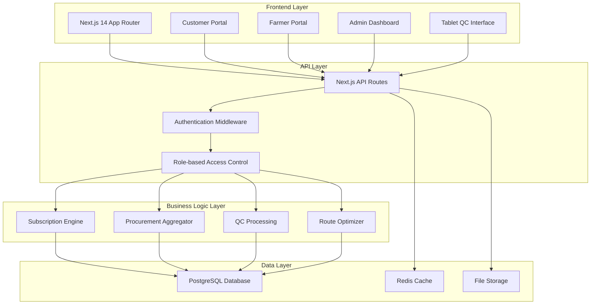

# Design Document

## Overview

AgroTrack+ is a comprehensive farm-to-table subscription platform built with Next.js 14 and TypeScript, designed to connect consumers with local farmers through a transparent, high-quality supply chain. The platform implements a "Modern Organic" design philosophy, combining clean, data-driven interfaces with earthy, human-centric aesthetics that reflect the agricultural nature of the business.

The architecture supports three primary user roles (Customer, Farmer, Admin/Operations) with role-based access control, real-time data synchronization, and scalable infrastructure designed for future automation capabilities.

## Architecture

### System Architecture



### Technology Stack

- **Frontend**: Next.js 14 with App Router, TypeScript, Tailwind CSS
- **UI Components**: Radix UI primitives with custom styling
- **State Management**: Zustand for global state, React Query for server state
- **Authentication**: NextAuth.js with role-based access control
- **Database**: PostgreSQL with Prisma ORM
- **Caching**: Redis for session management and API caching
- **File Storage**: AWS S3 for images and documents
- **Deployment**: Vercel for frontend, AWS for backend services

### Design System

The platform implements a "Modern Organic" design system with:

- **Color Palette**: 
  - Primary: Deep forest green (#2D5016)
  - Secondary: Warm earth brown (#8B4513)
  - Accent: Fresh carrot orange (#FF6B35)
  - Neutrals: Off-white (#FAFAFA), beige (#F5F5DC)
- **Typography**: 
  - Primary: Inter (sans-serif) for UI elements
  - Secondary: Lora (serif) for storytelling content
- **Visual Elements**: Soft rounded corners, subtle textures, high-quality agricultural photography

## Components and Interfaces

### Customer Portal Components

#### Authentication System
- **LoginForm**: Email/password authentication with validation
- **SignupForm**: Multi-step registration with email verification
- **ProfileManager**: Personal information and address management
- **PasswordReset**: Secure password recovery flow

#### Product Catalog
- **ProductGrid**: Responsive grid layout with filtering and search
- **ProductCard**: Product image, pricing, farmer info, availability status
- **TrustStatement**: Transparent pricing breakdown modal
- **FarmerStory**: Rich media farmer profiles and stories

#### Subscription Management
- **SubscriptionBuilder**: Interactive subscription creation wizard
- **ProductSelector**: Multi-select interface with quantity controls
- **DeliveryScheduler**: Zone-based delivery slot selection
- **SubscriptionDashboard**: Current subscription overview and modification controls

#### Order Management
- **OrderHistory**: Paginated list with status tracking
- **OrderDetails**: Itemized breakdown with delivery information
- **InvoiceGenerator**: PDF invoice generation and download

### Farmer Portal Components

#### Profile Management
- **FarmerProfile**: Farm information and certification management
- **DocumentUploader**: Secure file upload with validation
- **ContactManager**: Communication preferences and contact details

#### Delivery Management
- **DeliveryRequirements**: Upcoming delivery calendar and details
- **DeliveryConfirmation**: Delivery completion and issue reporting
- **CommunicationCenter**: Direct messaging with operations team

#### Analytics Dashboard
- **QCInsights**: Quality control performance charts and trends
- **PerformanceMetrics**: Delivery success rates and feedback scores
- **RevenueTracking**: Payment history and earnings projections

### Admin/Operations Components

#### Farmer Management
- **FarmerDirectory**: Searchable list with performance indicators
- **FarmerEditor**: CRUD operations for farmer profiles
- **PerformanceMonitor**: Quality and delivery performance tracking

#### Procurement Management
- **ProcurementAggregator**: Daily order consolidation engine
- **RequirementsDistributor**: Automated farmer notification system
- **InventoryManager**: Real-time stock level tracking

#### Quality Control Interface
- **QCWorkstation**: Tablet-optimized inspection interface
- **QualityAssessment**: Product evaluation with photo capture
- **RejectionManager**: Reason code selection and collaborative rescue workflows
- **InventoryUpdater**: Automatic stock adjustment based on QC results

#### Logistics Management
- **RouteOptimizer**: Zone-based delivery route planning
- **DriverAssignment**: Route allocation and driver management
- **DeliveryTracker**: Real-time delivery status monitoring

## Data Models

### Core Entities

```typescript
// User Management
interface User {
  id: string;
  email: string;
  name: string;
  role: UserRole;
  createdAt: Date;
  updatedAt: Date;
}

interface Customer extends User {
  phone: string;
  addresses: Address[];
  subscriptions: Subscription[];
  orders: Order[];
}

interface Farmer extends User {
  farmName: string;
  location: string;
  certifications: Certification[];
  products: Product[];
  deliveries: FarmerDelivery[];
  qcHistory: QCResult[];
}

// Product Management
interface Product {
  id: string;
  name: string;
  category: string;
  description: string;
  images: string[];
  basePrice: number;
  unit: string;
  seasonality: SeasonInfo;
  farmerId: string;
}

// Subscription System
interface Subscription {
  id: string;
  customerId: string;
  products: SubscriptionItem[];
  deliveryZone: string;
  deliveryDay: string;
  status: SubscriptionStatus;
  startDate: Date;
  pausedUntil?: Date;
}

interface SubscriptionItem {
  productId: string;
  quantity: number;
  frequency: 'weekly' | 'biweekly' | 'monthly';
}

// Order Management
interface Order {
  id: string;
  customerId: string;
  subscriptionId?: string;
  items: OrderItem[];
  deliveryAddress: Address;
  deliverySlot: DeliverySlot;
  status: OrderStatus;
  totalAmount: number;
  createdAt: Date;
}

// Quality Control
interface QCResult {
  id: string;
  farmerDeliveryId: string;
  productId: string;
  expectedQuantity: number;
  acceptedQuantity: number;
  rejectedQuantity: number;
  rejectionReasons: RejectionReason[];
  photos: string[];
  inspectorId: string;
  timestamp: Date;
}

// Logistics
interface DeliveryRoute {
  id: string;
  driverId: string;
  zone: string;
  date: Date;
  orders: Order[];
  optimizedSequence: string[];
  status: RouteStatus;
}
```

### Database Schema Design

The PostgreSQL database will use the following table structure:

- **users**: Core user authentication and profile data
- **customers**: Customer-specific information and preferences
- **farmers**: Farmer profiles, certifications, and farm details
- **products**: Product catalog with pricing and availability
- **subscriptions**: Customer subscription configurations
- **orders**: Individual order records and fulfillment data
- **qc_results**: Quality control inspection records
- **delivery_routes**: Logistics planning and execution data
- **notifications**: System-generated user notifications

## Error Handling

### Client-Side Error Handling

- **Form Validation**: Real-time validation with Zod schemas
- **API Error Boundaries**: Graceful degradation for network failures
- **User Feedback**: Toast notifications for success/error states
- **Offline Support**: Service worker for basic offline functionality

### Server-Side Error Handling

- **Input Validation**: Comprehensive request validation middleware
- **Database Errors**: Transaction rollback and error logging
- **Authentication Errors**: Secure error messages without information leakage
- **Rate Limiting**: API protection against abuse

### Error Recovery Strategies

- **Retry Logic**: Automatic retry for transient failures
- **Fallback Data**: Cached data when real-time updates fail
- **Manual Recovery**: Admin tools for data correction and system recovery
- **User Communication**: Clear error messages with actionable next steps

## Testing Strategy

### Unit Testing
- **Component Testing**: React Testing Library for UI components
- **Business Logic**: Jest for utility functions and data processing
- **API Routes**: Supertest for endpoint testing
- **Database Operations**: In-memory database for isolated testing

### Integration Testing
- **User Flows**: End-to-end testing with Playwright
- **API Integration**: Full request/response cycle testing
- **Database Integration**: Real database testing with test fixtures
- **Third-party Services**: Mock external API dependencies

### Performance Testing
- **Load Testing**: Simulated user load for scalability validation
- **Database Performance**: Query optimization and indexing validation
- **Frontend Performance**: Core Web Vitals monitoring
- **API Response Times**: Endpoint performance benchmarking

### Quality Assurance
- **Accessibility Testing**: WCAG 2.1 compliance validation
- **Cross-browser Testing**: Multi-browser compatibility verification
- **Mobile Responsiveness**: Device-specific testing across screen sizes
- **Security Testing**: Authentication, authorization, and data protection validation

## Security Considerations

### Authentication & Authorization
- **JWT Tokens**: Secure session management with refresh tokens
- **Role-based Access**: Granular permissions for different user types
- **Password Security**: Bcrypt hashing with salt rounds
- **Session Management**: Secure cookie handling and expiration

### Data Protection
- **Input Sanitization**: XSS and injection attack prevention
- **HTTPS Enforcement**: SSL/TLS for all data transmission
- **File Upload Security**: Virus scanning and file type validation
- **Database Security**: Parameterized queries and connection encryption

### Privacy Compliance
- **Data Minimization**: Collect only necessary user information
- **Consent Management**: Clear privacy policy and user consent tracking
- **Data Retention**: Automated cleanup of expired data
- **User Rights**: Data export and deletion capabilities

## Performance Optimization

### Frontend Optimization
- **Code Splitting**: Route-based and component-based lazy loading
- **Image Optimization**: Next.js Image component with WebP support
- **Caching Strategy**: Browser caching and CDN integration
- **Bundle Analysis**: Regular bundle size monitoring and optimization

### Backend Optimization
- **Database Indexing**: Strategic indexes for common query patterns
- **Query Optimization**: N+1 query prevention and efficient joins
- **Caching Layer**: Redis for frequently accessed data
- **API Response Optimization**: Pagination and field selection

### Infrastructure Optimization
- **CDN Integration**: Global content delivery for static assets
- **Database Connection Pooling**: Efficient database connection management
- **Monitoring**: Application performance monitoring and alerting
- **Scalability Planning**: Horizontal scaling preparation for growth phases