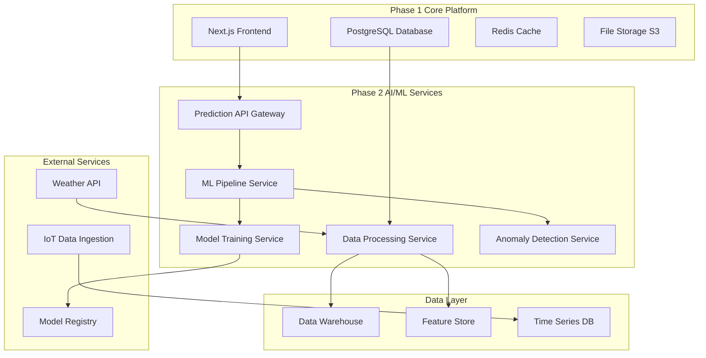
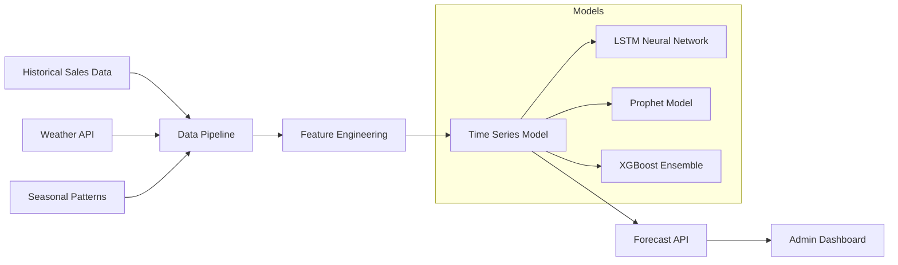
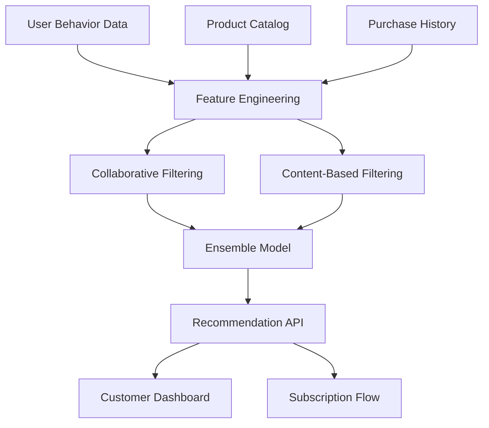
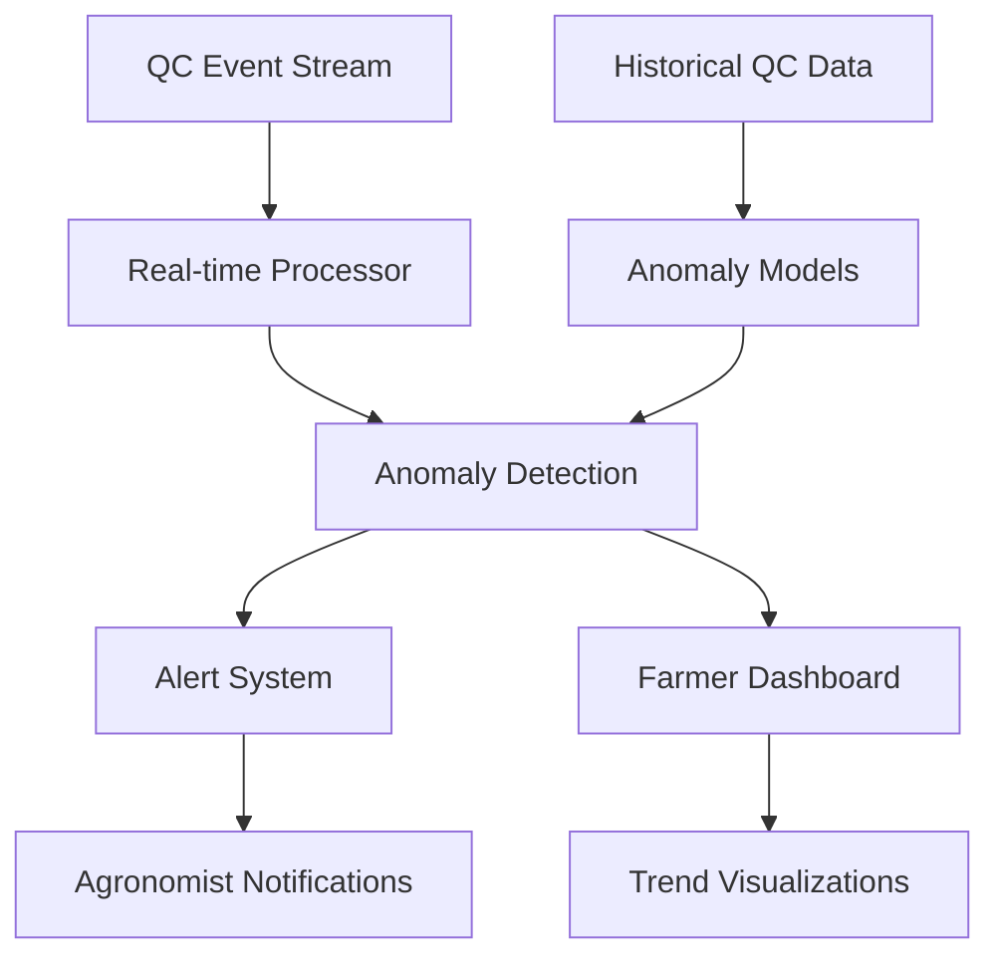
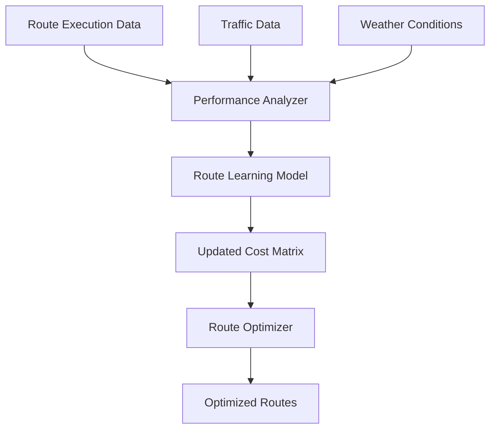
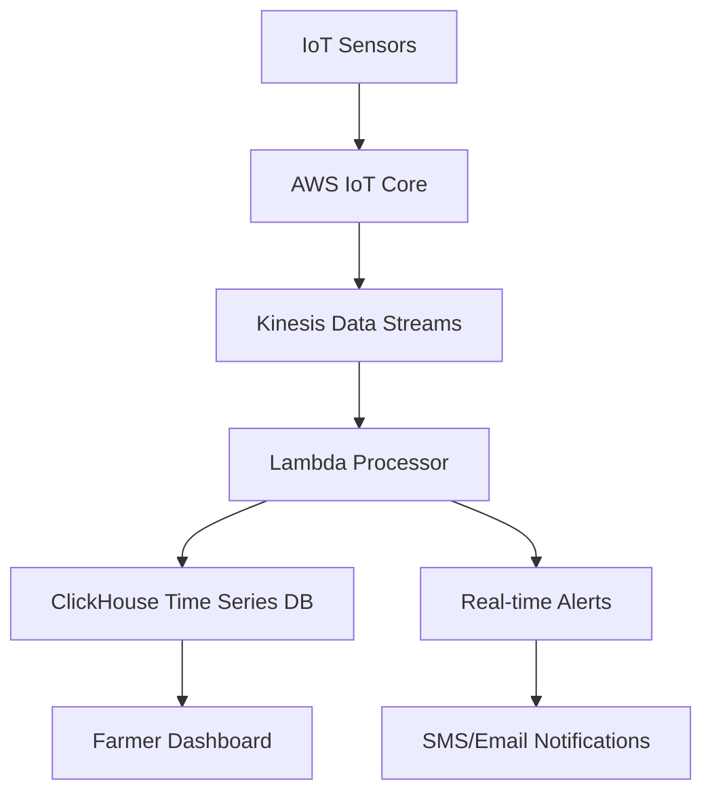

# AgroTrack+ Phase 2: AI/ML & Data Intelligence Design Document

## Overview

Phase 2 transforms AgroTrack+ into an intelligent, data-driven platform by implementing machine learning models, predictive analytics, and automated decision-making systems. This design builds upon the solid Phase 1 foundation while introducing new microservices architecture for AI/ML capabilities.

## Architecture Overview

### High-Level Architecture



### Technology Stack Evolution

#### AI/ML Services
- **Python**: Core ML development with scikit-learn, TensorFlow, PyTorch
- **FastAPI**: High-performance API framework for ML services
- **Apache Airflow**: Workflow orchestration for data pipelines
- **MLflow**: Model lifecycle management and experiment tracking
- **AWS SageMaker**: Model training and deployment platform

#### Data Infrastructure
- **Apache Kafka**: Real-time data streaming
- **AWS Glue**: ETL data processing
- **ClickHouse**: Time-series analytics database
- **Apache Spark**: Large-scale data processing
- **Redis**: Feature caching and real-time predictions

#### Deployment & Monitoring
- **Docker & Kubernetes**: Containerized microservices
- **AWS ECS/EKS**: Container orchestration
- **Prometheus & Grafana**: Monitoring and alerting
- **AWS CloudWatch**: Centralized logging

## Component Design

### 1. Demand Forecasting System

#### Architecture


#### Data Model
```python
# Feature Schema
class DemandFeatures:
    sku_id: str
    date: datetime
    historical_sales: List[float]
    weather_temp: float
    weather_precipitation: float
    is_holiday: bool
    day_of_week: int
    month: int
    seasonal_index: float
    price: float
    promotion_active: bool
```

#### API Design
```typescript
// Forecast API Endpoints
GET /api/v2/forecasts/sku/{sku_id}?days=30
POST /api/v2/forecasts/batch
GET /api/v2/forecasts/accuracy-metrics
POST /api/v2/forecasts/retrain

// Response Schema
interface ForecastResponse {
  sku_id: string
  predictions: Array<{
    date: string
    predicted_demand: number
    confidence_interval: {
      lower: number
      upper: number
    }
    factors: {
      weather_impact: number
      seasonal_impact: number
      trend_impact: number
    }
  }>
  model_accuracy: number
  last_updated: string
}
```

#### Implementation Details

**Data Pipeline**
```python
class DemandForecastPipeline:
    def __init__(self):
        self.weather_client = WeatherAPIClient()
        self.db_client = PostgreSQLClient()
        self.feature_store = FeatureStore()
    
    def extract_features(self, sku_id: str, lookback_days: int = 365):
        # Extract historical sales data
        sales_data = self.db_client.get_sales_history(sku_id, lookback_days)
        
        # Get weather data
        weather_data = self.weather_client.get_historical_weather(lookback_days)
        
        # Engineer features
        features = self.create_features(sales_data, weather_data)
        
        return features
    
    def train_model(self, features: pd.DataFrame):
        # Ensemble of multiple models
        models = {
            'lstm': LSTMModel(),
            'prophet': ProphetModel(),
            'xgboost': XGBoostModel()
        }
        
        ensemble = EnsembleModel(models)
        ensemble.fit(features)
        
        return ensemble
```

**Model Training Service**
```python
@app.post("/train-demand-model")
async def train_demand_model(sku_id: str):
    pipeline = DemandForecastPipeline()
    features = pipeline.extract_features(sku_id)
    model = pipeline.train_model(features)
    
    # Save to model registry
    model_registry.save_model(f"demand_forecast_{sku_id}", model)
    
    return {"status": "success", "model_id": model.id}
```

### 2. Customer Recommendation Engine

#### Architecture


#### Recommendation Models

**Collaborative Filtering**
```python
class CollaborativeFilteringModel:
    def __init__(self):
        self.model = NMF(n_components=50, random_state=42)
        self.user_encoder = LabelEncoder()
        self.item_encoder = LabelEncoder()
    
    def fit(self, interactions: pd.DataFrame):
        # Create user-item matrix
        user_item_matrix = self.create_interaction_matrix(interactions)
        
        # Train matrix factorization model
        self.model.fit(user_item_matrix)
        
        return self
    
    def predict(self, user_id: str, n_recommendations: int = 10):
        user_idx = self.user_encoder.transform([user_id])[0]
        user_vector = self.model.transform([self.get_user_vector(user_id)])
        
        # Calculate scores for all items
        item_scores = user_vector.dot(self.model.components_)
        
        # Get top recommendations
        top_items = np.argsort(item_scores[0])[::-1][:n_recommendations]
        
        return self.item_encoder.inverse_transform(top_items)
```

**Content-Based Filtering**
```python
class ContentBasedModel:
    def __init__(self):
        self.tfidf = TfidfVectorizer(max_features=1000)
        self.similarity_matrix = None
    
    def fit(self, products: pd.DataFrame):
        # Create product feature vectors
        product_features = self.create_product_features(products)
        
        # Calculate similarity matrix
        self.similarity_matrix = cosine_similarity(
            self.tfidf.fit_transform(product_features)
        )
        
        return self
    
    def recommend_similar_products(self, product_id: str, n_recommendations: int = 5):
        product_idx = self.get_product_index(product_id)
        similarities = self.similarity_matrix[product_idx]
        
        # Get most similar products
        similar_indices = np.argsort(similarities)[::-1][1:n_recommendations+1]
        
        return self.get_products_by_indices(similar_indices)
```

#### API Implementation
```python
@app.get("/api/v2/recommendations/customer/{customer_id}")
async def get_customer_recommendations(
    customer_id: str,
    limit: int = 10,
    include_explanations: bool = True
):
    # Get collaborative filtering recommendations
    cf_recs = collaborative_model.predict(customer_id, limit * 2)
    
    # Get content-based recommendations
    user_history = get_user_purchase_history(customer_id)
    cb_recs = []
    for product in user_history[-5:]:  # Last 5 purchases
        cb_recs.extend(content_model.recommend_similar_products(product.id))
    
    # Ensemble recommendations
    final_recs = ensemble_recommendations(cf_recs, cb_recs, limit)
    
    if include_explanations:
        final_recs = add_explanations(final_recs, customer_id)
    
    return {
        "customer_id": customer_id,
        "recommendations": final_recs,
        "generated_at": datetime.utcnow()
    }
```

### 3. AI-Powered Farmer Insights & Anomaly Detection

#### Architecture


#### Anomaly Detection Models

**Statistical Anomaly Detection**
```python
class QualityAnomalyDetector:
    def __init__(self):
        self.isolation_forest = IsolationForest(contamination=0.1)
        self.statistical_detector = StatisticalAnomalyDetector()
        self.trend_detector = TrendAnomalyDetector()
    
    def fit(self, qc_data: pd.DataFrame):
        # Prepare features for anomaly detection
        features = self.engineer_qc_features(qc_data)
        
        # Train isolation forest
        self.isolation_forest.fit(features)
        
        # Fit statistical models
        self.statistical_detector.fit(qc_data)
        self.trend_detector.fit(qc_data)
        
        return self
    
    def detect_anomalies(self, new_qc_data: pd.DataFrame):
        anomalies = []
        
        # Isolation forest detection
        if_anomalies = self.isolation_forest.predict(new_qc_data)
        
        # Statistical anomalies
        stat_anomalies = self.statistical_detector.detect(new_qc_data)
        
        # Trend anomalies
        trend_anomalies = self.trend_detector.detect(new_qc_data)
        
        # Combine and prioritize anomalies
        combined_anomalies = self.combine_anomaly_signals(
            if_anomalies, stat_anomalies, trend_anomalies
        )
        
        return combined_anomalies
```

**Real-time Processing**
```python
class QCAnomalyProcessor:
    def __init__(self):
        self.kafka_consumer = KafkaConsumer('qc-events')
        self.anomaly_detector = QualityAnomalyDetector()
        self.alert_service = AlertService()
    
    async def process_qc_stream(self):
        async for message in self.kafka_consumer:
            qc_event = QCEvent.from_json(message.value)
            
            # Check for anomalies
            anomalies = self.anomaly_detector.detect_anomalies([qc_event])
            
            if anomalies:
                await self.handle_anomalies(anomalies, qc_event)
    
    async def handle_anomalies(self, anomalies: List[Anomaly], qc_event: QCEvent):
        for anomaly in anomalies:
            # Create support log entry
            support_log = FarmerSupportLog(
                farmer_id=qc_event.farmer_id,
                anomaly_type=anomaly.type,
                severity=anomaly.severity,
                description=anomaly.description,
                detected_at=datetime.utcnow()
            )
            
            await self.db.save(support_log)
            
            # Send notifications
            if anomaly.severity >= Severity.HIGH:
                await self.alert_service.notify_agronomist(anomaly, qc_event)
```

### 4. Logistics Optimization Feedback Loop

#### Architecture


#### Route Learning System
```python
class RouteOptimizationLearner:
    def __init__(self):
        self.performance_model = GradientBoostingRegressor()
        self.cost_matrix_updater = CostMatrixUpdater()
        self.route_optimizer = RouteOptimizer()
    
    def learn_from_performance(self, route_data: pd.DataFrame):
        # Extract features from route performance
        features = self.extract_route_features(route_data)
        
        # Train performance prediction model
        self.performance_model.fit(
            features[['distance', 'time_of_day', 'weather', 'traffic']],
            features['actual_duration']
        )
        
        # Update cost matrix based on learned patterns
        updated_costs = self.cost_matrix_updater.update(
            self.performance_model, route_data
        )
        
        return updated_costs
    
    def optimize_routes_with_learning(self, delivery_requests: List[DeliveryRequest]):
        # Use learned cost matrix for optimization
        optimized_routes = self.route_optimizer.optimize(
            delivery_requests,
            cost_matrix=self.learned_cost_matrix
        )
        
        return optimized_routes
```

### 5. Advanced Farmer Dashboard v2

#### New Components Design

**Cost Tracking Module**
```typescript
interface CostTrackingData {
  farmerId: string
  season: string
  crops: Array<{
    cropType: string
    plantedArea: number
    costs: {
      seeds: number
      fertilizer: number
      labor: number
      equipment: number
      irrigation: number
      pesticides: number
    }
    expectedYield: number
    actualYield?: number
  }>
}

// React Component
const CostTrackingDashboard: React.FC = () => {
  const [costData, setCostData] = useState<CostTrackingData>()
  const [profitabilityAnalysis, setProfitabilityAnalysis] = useState<ProfitabilityData>()
  
  return (
    <ResponsiveGrid cols={{ default: 1, md: 2, lg: 3 }}>
      <CostInputForm onSubmit={handleCostSubmit} />
      <YieldCalculator costData={costData} />
      <ProfitabilityChart data={profitabilityAnalysis} />
      <ROIComparison farmerId={costData?.farmerId} />
      <CropRecommendations farmerId={costData?.farmerId} />
    </ResponsiveGrid>
  )
}
```

**Yield Analysis Component**
```typescript
const YieldAnalysisWidget: React.FC<{ farmerId: string }> = ({ farmerId }) => {
  const { data: yieldData } = useQuery(['yield-analysis', farmerId], 
    () => fetchYieldAnalysis(farmerId)
  )
  
  return (
    <Card>
      <CardHeader>
        <CardTitle>Yield Analysis</CardTitle>
      </CardHeader>
      <CardContent>
        <ResponsiveContainer width="100%" height={300}>
          <LineChart data={yieldData?.trends}>
            <XAxis dataKey="month" />
            <YAxis />
            <Tooltip />
            <Line dataKey="actualYield" stroke="#8884d8" />
            <Line dataKey="expectedYield" stroke="#82ca9d" />
          </LineChart>
        </ResponsiveContainer>
        
        <div className="mt-4 grid grid-cols-2 gap-4">
          <MetricCard 
            title="Average Yield/Acre" 
            value={yieldData?.avgYieldPerAcre} 
            unit="lbs"
          />
          <MetricCard 
            title="Yield Efficiency" 
            value={yieldData?.efficiency} 
            unit="%"
          />
        </div>
      </CardContent>
    </Card>
  )
}
```

### 6. IoT Sensor Integration

#### Data Ingestion Architecture


#### IoT Data Processing
```python
class IoTDataProcessor:
    def __init__(self):
        self.clickhouse_client = ClickHouseClient()
        self.alert_service = AlertService()
        self.threshold_manager = ThresholdManager()
    
    def process_sensor_data(self, sensor_data: SensorReading):
        # Store in time-series database
        await self.clickhouse_client.insert_sensor_reading(sensor_data)
        
        # Check thresholds
        thresholds = self.threshold_manager.get_thresholds(
            sensor_data.farmer_id, 
            sensor_data.sensor_type
        )
        
        if self.is_threshold_exceeded(sensor_data, thresholds):
            await self.alert_service.send_threshold_alert(sensor_data)
        
        # Update real-time dashboard
        await self.update_dashboard_cache(sensor_data)
    
    def analyze_sensor_trends(self, farmer_id: str, days: int = 30):
        # Get historical sensor data
        sensor_data = self.clickhouse_client.get_sensor_history(
            farmer_id, days
        )
        
        # Analyze correlations with crop quality
        correlations = self.analyze_quality_correlations(
            sensor_data, farmer_id
        )
        
        return {
            'trends': sensor_data,
            'correlations': correlations,
            'recommendations': self.generate_recommendations(correlations)
        }
```

### 7. New Category Scaffolding

#### Extended Database Schema
```sql
-- Extended product categories
ALTER TABLE products ADD COLUMN category_type VARCHAR(50) DEFAULT 'produce';
ALTER TABLE products ADD COLUMN storage_requirements JSONB;
ALTER TABLE products ADD COLUMN shelf_life_days INTEGER;
ALTER TABLE products ADD COLUMN batch_tracking_required BOOLEAN DEFAULT FALSE;

-- Dairy-specific attributes
CREATE TABLE dairy_products (
    product_id UUID REFERENCES products(id),
    fat_content DECIMAL(4,2),
    pasteurization_type VARCHAR(50),
    use_by_date DATE,
    storage_temperature_min INTEGER,
    storage_temperature_max INTEGER
);

-- Protein-specific attributes
CREATE TABLE protein_products (
    product_id UUID REFERENCES products(id),
    protein_type VARCHAR(50), -- beef, chicken, fish, etc.
    cut_type VARCHAR(100),
    batch_number VARCHAR(100),
    processing_date DATE,
    usda_grade VARCHAR(20),
    organic_certified BOOLEAN DEFAULT FALSE
);

-- Enhanced QC for new categories
ALTER TABLE qc_inspections ADD COLUMN temperature_check DECIMAL(4,1);
ALTER TABLE qc_inspections ADD COLUMN batch_verification BOOLEAN;
ALTER TABLE qc_inspections ADD COLUMN expiry_date_check BOOLEAN;
```

#### Category-Specific QC Interface
```typescript
interface CategorySpecificQC {
  produce: {
    visualInspection: boolean
    ripeness: 'underripe' | 'optimal' | 'overripe'
    pestResidueTest?: boolean
  }
  dairy: {
    temperatureCheck: number
    expiryDateVerification: boolean
    packagingIntegrity: boolean
    bacterialTest?: boolean
  }
  protein: {
    temperatureCheck: number
    batchVerification: boolean
    colorInspection: boolean
    textureAssessment: boolean
    usdaGradeVerification?: boolean
  }
}

const CategorySpecificQCForm: React.FC<{ category: ProductCategory }> = ({ category }) => {
  const renderCategoryFields = () => {
    switch (category) {
      case 'dairy':
        return <DairyQCFields />
      case 'protein':
        return <ProteinQCFields />
      default:
        return <ProduceQCFields />
    }
  }
  
  return (
    <Card>
      <CardHeader>
        <CardTitle>Quality Control - {category}</CardTitle>
      </CardHeader>
      <CardContent>
        {renderCategoryFields()}
      </CardContent>
    </Card>
  )
}
```

## Data Architecture

### Data Pipeline Design

#### ETL Pipeline for ML Features
```python
class MLDataPipeline:
    def __init__(self):
        self.postgres_client = PostgreSQLClient()
        self.clickhouse_client = ClickHouseClient()
        self.feature_store = FeatureStore()
        self.airflow_dag = self.create_airflow_dag()
    
    def create_airflow_dag(self):
        dag = DAG(
            'ml_feature_pipeline',
            schedule_interval='@hourly',
            start_date=datetime(2024, 1, 1)
        )
        
        # Extract task
        extract_task = PythonOperator(
            task_id='extract_transactional_data',
            python_callable=self.extract_data,
            dag=dag
        )
        
        # Transform task
        transform_task = PythonOperator(
            task_id='transform_features',
            python_callable=self.transform_features,
            dag=dag
        )
        
        # Load task
        load_task = PythonOperator(
            task_id='load_feature_store',
            python_callable=self.load_features,
            dag=dag
        )
        
        extract_task >> transform_task >> load_task
        
        return dag
```

### Feature Store Design
```python
class FeatureStore:
    def __init__(self):
        self.redis_client = redis.Redis()
        self.clickhouse_client = ClickHouseClient()
    
    def store_features(self, feature_group: str, features: Dict):
        # Store in Redis for real-time access
        self.redis_client.hset(
            f"features:{feature_group}",
            mapping=features
        )
        
        # Store in ClickHouse for historical analysis
        self.clickhouse_client.insert_features(feature_group, features)
    
    def get_features(self, feature_group: str, entity_id: str):
        # Try Redis first for speed
        cached_features = self.redis_client.hget(
            f"features:{feature_group}", entity_id
        )
        
        if cached_features:
            return json.loads(cached_features)
        
        # Fallback to ClickHouse
        return self.clickhouse_client.get_features(feature_group, entity_id)
```

## API Design

### ML Service API Gateway
```python
from fastapi import FastAPI, HTTPException
from pydantic import BaseModel

app = FastAPI(title="AgroTrack ML Services", version="2.0.0")

class PredictionRequest(BaseModel):
    model_type: str
    input_data: Dict[str, Any]
    options: Optional[Dict[str, Any]] = None

class PredictionResponse(BaseModel):
    prediction: Any
    confidence: Optional[float] = None
    explanation: Optional[Dict[str, Any]] = None
    model_version: str
    timestamp: datetime

@app.post("/predict", response_model=PredictionResponse)
async def predict(request: PredictionRequest):
    try:
        model_service = get_model_service(request.model_type)
        result = await model_service.predict(request.input_data, request.options)
        
        return PredictionResponse(
            prediction=result.prediction,
            confidence=result.confidence,
            explanation=result.explanation,
            model_version=result.model_version,
            timestamp=datetime.utcnow()
        )
    except Exception as e:
        raise HTTPException(status_code=500, detail=str(e))

@app.get("/models/{model_type}/health")
async def model_health(model_type: str):
    model_service = get_model_service(model_type)
    health_status = await model_service.health_check()
    
    return {
        "model_type": model_type,
        "status": health_status.status,
        "last_trained": health_status.last_trained,
        "accuracy": health_status.accuracy
    }
```

## Security Considerations

### ML Model Security
- **Model Versioning**: All models versioned and signed
- **Input Validation**: Strict validation of all ML inputs
- **Rate Limiting**: Prevent abuse of prediction endpoints
- **Audit Logging**: Complete audit trail of all predictions

### Data Privacy
- **Feature Anonymization**: PII removed from training data
- **Differential Privacy**: Applied to sensitive aggregations
- **Access Controls**: Role-based access to ML features
- **Data Retention**: Automated cleanup of old training data

## Monitoring and Observability

### ML Model Monitoring
```python
class ModelMonitor:
    def __init__(self):
        self.prometheus_client = PrometheusClient()
        self.alertmanager = AlertManager()
    
    def track_prediction(self, model_name: str, prediction: Any, actual: Any = None):
        # Track prediction metrics
        self.prometheus_client.increment_counter(
            'ml_predictions_total',
            labels={'model': model_name}
        )
        
        # Track accuracy if actual value available
        if actual is not None:
            accuracy = self.calculate_accuracy(prediction, actual)
            self.prometheus_client.set_gauge(
                'ml_model_accuracy',
                accuracy,
                labels={'model': model_name}
            )
            
            # Alert if accuracy drops
            if accuracy < self.get_accuracy_threshold(model_name):
                self.alertmanager.send_alert(
                    f"Model {model_name} accuracy dropped to {accuracy}"
                )
    
    def track_data_drift(self, model_name: str, input_data: Dict):
        # Detect data drift in input features
        drift_score = self.calculate_drift_score(model_name, input_data)
        
        self.prometheus_client.set_gauge(
            'ml_data_drift_score',
            drift_score,
            labels={'model': model_name}
        )
        
        if drift_score > self.get_drift_threshold(model_name):
            self.alertmanager.send_alert(
                f"Data drift detected for model {model_name}: {drift_score}"
            )
```

## Testing Strategy

### ML Model Testing
```python
class MLModelTester:
    def __init__(self):
        self.test_data_loader = TestDataLoader()
        self.model_registry = ModelRegistry()
    
    def test_model_accuracy(self, model_name: str, version: str):
        model = self.model_registry.load_model(model_name, version)
        test_data = self.test_data_loader.load_test_set(model_name)
        
        predictions = model.predict(test_data.features)
        accuracy = calculate_accuracy(predictions, test_data.labels)
        
        assert accuracy > self.get_minimum_accuracy(model_name), \
            f"Model accuracy {accuracy} below threshold"
        
        return accuracy
    
    def test_model_performance(self, model_name: str):
        model = self.model_registry.load_model(model_name)
        
        # Test prediction latency
        start_time = time.time()
        model.predict(self.generate_test_input())
        latency = time.time() - start_time
        
        assert latency < 0.5, f"Model latency {latency}s exceeds 500ms limit"
        
        return latency
```

## Deployment Strategy

### Microservices Deployment
```yaml
# kubernetes/ml-services.yaml
apiVersion: apps/v1
kind: Deployment
metadata:
  name: demand-forecast-service
spec:
  replicas: 3
  selector:
    matchLabels:
      app: demand-forecast-service
  template:
    metadata:
      labels:
        app: demand-forecast-service
    spec:
      containers:
      - name: demand-forecast
        image: agrotrack/demand-forecast:v2.0.0
        ports:
        - containerPort: 8000
        env:
        - name: MODEL_REGISTRY_URL
          value: "http://model-registry:8080"
        - name: FEATURE_STORE_URL
          value: "redis://feature-store:6379"
        resources:
          requests:
            memory: "512Mi"
            cpu: "250m"
          limits:
            memory: "1Gi"
            cpu: "500m"
        livenessProbe:
          httpGet:
            path: /health
            port: 8000
          initialDelaySeconds: 30
          periodSeconds: 10
```

This comprehensive design document provides the technical foundation for implementing all Phase 2 AI/ML features while maintaining the quality and consistency established in Phase 1. The architecture is designed to be scalable, maintainable, and aligned with modern ML engineering best practices.